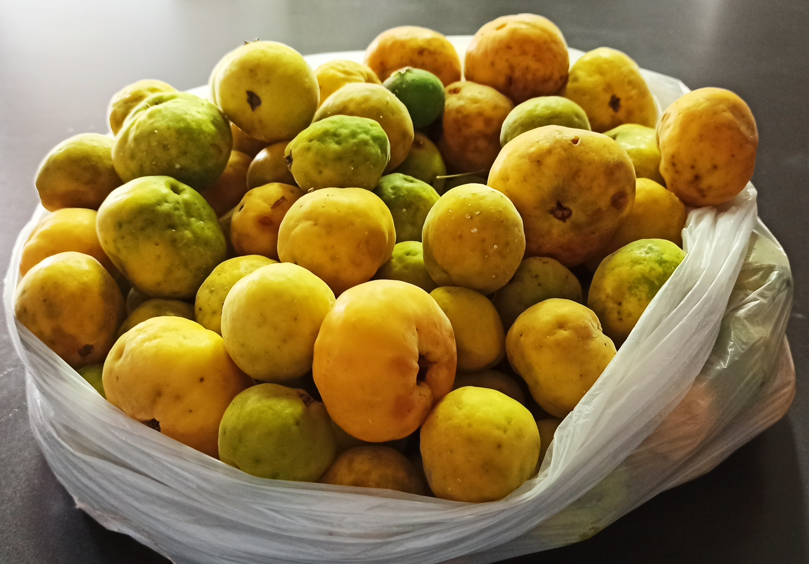

```{r pressure, echo=FALSE, fig.cap="A caption", out.width = '100%'}

```

The fruit harvest was staggered in three weeks corresponding to the second, third and fourth week of December of the years 2019, 2020 and 2021. The fruits of each individual were weighed to compare yields between years by ANOVA.

```{r, echo=FALSE, fig.align='center', fig.asp=0.4, fig.width=30, fig.height=8}
knitr::opts_chunk$set(warning = FALSE, message = FALSE, echo = FALSE)

data<-read.delim("rendmor.txt")

data$YEAR<-as.factor(data$YEAR)
data$ACC<-as.factor(data$ACC)
data$WEEK<-as.factor(data$WEEK)
data$WEEK<-factor(data$WEEK,levels=c("1","2","3"))
data$DATE<-as.Date(data$DATE, format="%m/%d/%y")
data$N<-as.numeric(data$N)

```

```{r, echo=FALSE, fig.align='center', fig.asp=0.4, fig.width=30, fig.height=8}
knitr::opts_chunk$set(warning = FALSE, message = FALSE, echo = FALSE)

dataY2<-read.delim("rendmor2.txt")
dataY2$YEAR<-as.factor(dataY2$YEAR)
dataY2$ACC<-as.factor(dataY2$ACC)
dataY2$P<-as.numeric(dataY2$P)


```

# Average fresh weight (g) per plant.

```{r, echo=FALSE, fig.align='center', fig.asp=0.4, fig.width=10, fig.height=8}
knitr::opts_chunk$set(warning = FALSE, message = FALSE, echo = FALSE)

library(ggplot2)
Y0<- ggplot(dataY2, aes(x=ACC, y=P, fill=YEAR)) +
  stat_summary(fun = "mean", size = 1, geom = "bar", position="dodge", width=0.5) +
  scale_fill_manual(values=c("coral", "grey","green4"))+
  # geom_errorbar(aes(ymin=P-sd, ymax=P+sd), width=0.2, position=position_dodge(.5))+
  labs(y="Fresh weight (g)", x="Genotype")+
  theme_classic()+
  theme(legend.position = "bottom")+
  theme(panel.grid.major.y = element_line(size=0.05, color='black'))+
  theme(panel.grid.major.x = element_blank())+
  theme(text = element_text(size=20, color='black'))+
  theme(axis.text = element_text(color='black'))+
  ylim(0,2200)
  # geom_text(aes(label = round(P,0)), vjust = 1.5, hjust = -0.2, size=7)
Y0

```

# Bars plot.
```{r, echo=FALSE, fig.align='center', fig.asp=0.4, fig.width=20, fig.height=11}
knitr::opts_chunk$set(warning = FALSE, message = FALSE, echo = FALSE)

datas2<-subset(data, YEAR == 2019 | YEAR == 2020)

library(tidyverse)
library(ggplot2)
f1<-ggplot(data=datas2, aes(x=WEEK, y=P, fill=ACC)) + 
  geom_bar(stat="identity", position="dodge")+
  # scale_fill_manual(values=c("coral", "grey","green4"))+
  # geom_point(size=3, shape=20) +
  labs(y="Fresh Weigth (g)", x="Week")+
  theme(panel.grid.major.x = element_blank())+
  facet_grid(YEAR~.)+
  theme_classic()+
  theme(text = element_text(size=20))+
  theme(legend.title=element_blank())+
  theme(legend.position = "bottom")+
  theme(panel.grid.major.y = element_line(size=0.05, color='black'))+
  theme(panel.grid.major.x = element_blank())+
  theme(text = element_text(size=30, color='black'))+
  theme(axis.text = element_text(color='black'))
f1

```

```{r, echo=FALSE, fig.align='center', fig.asp=0.4, fig.width=20, fig.height=11}
knitr::opts_chunk$set(warning = FALSE, message = FALSE, echo = FALSE)


f1s<-ggplot(data=datas2, aes(x=YEAR, y=P, fill=ACC)) + 
  geom_bar(stat="identity", position="dodge")+
  # scale_fill_manual(values=c("coral", "grey","green4"))+
  # geom_point(size=3, shape=20) +
  labs(y="Fresh Weigth (g)", x="Year")+
  theme(panel.grid.major.x = element_blank())+
  facet_grid(WEEK~.)+
  theme_classic()+
  theme(text = element_text(size=20))+
  theme(legend.title=element_blank())+
  theme(legend.position = "bottom")+
  theme(panel.grid.major.y = element_line(size=0.05, color='black'))+
  theme(panel.grid.major.x = element_blank())+
  theme(text = element_text(size=30, color='black'))+
  theme(axis.text = element_text(color='black'))
f1s

```

# Bars plot.
```{r, echo=FALSE, fig.align='center', fig.asp=0.4, fig.width=20, fig.height=11}
knitr::opts_chunk$set(warning = FALSE, message = FALSE, echo = FALSE)

library(tidyverse)
library(ggplot2)
f1B<-ggplot(data=dataY2, aes(x=YEAR, y=P, fill=ACC)) + 
  geom_bar(stat="identity", position="dodge")+
  labs(y="WEIGHT (g)", x="YEAR")+
  theme(panel.grid.major.x = element_blank())+
  theme_classic()+
  theme(text = element_text(size=20))+
  theme(legend.title=element_blank())+
  theme(legend.position = "bottom")+
  theme(panel.grid.major.y = element_line(size=0.05, color='black'))+
  theme(panel.grid.major.x = element_blank())+
  theme(text = element_text(size=20, color='black'))+
  theme(axis.text = element_text(color='black'))
f1B

```

# Decriptive table for years
```{r, echo=FALSE, fig.align='center', fig.asp=0.4, fig.width=10, fig.height=8}
knitr::opts_chunk$set(warning = FALSE, message = FALSE, echo = FALSE)

library(Rmisc)
dataY<-subset(data, P >= 00.001)
estadY <- summarySE(dataY2, measurevar="P", groupvars=c("YEAR"))
estadY


```

# Average plant fresh weight (g) per year.

```{r, echo=FALSE, fig.align='center', fig.asp=0.4, fig.width=10, fig.height=8}
knitr::opts_chunk$set(warning = FALSE, message = FALSE, echo = FALSE)

P3<- ggplot(estadY, aes(x=YEAR, y=P, fill=YEAR)) +
  stat_summary(fun = "mean", size = 0.5, geom = "bar") +
  scale_fill_manual(values=c("coral", "grey","green4"))+
  geom_errorbar(aes(ymin=P-sd, ymax=P+sd), width=0.2, position=position_dodge(.5))+
  labs(y="Average fresh weight (g) per plant", x="Year")+
  theme_classic()+
  theme(legend.position = "none")+
  theme(panel.grid.major.y = element_line(size=0.05, color='black'))+
  theme(panel.grid.major.x = element_blank())+
  theme(text = element_text(size=20, color='black'))+
  theme(axis.text = element_text(color='black'))+
  ylim(0,1500)+
  geom_text(aes(label = round(P,0)), vjust = 1.5, hjust = -0.2, size=7)
P3

```
The bars indicate standard deviation.


```{r, echo=FALSE, fig.align='center', fig.asp=0.4, fig.width=20, fig.height=12}
knitr::opts_chunk$set(warning = FALSE, message = FALSE, echo = FALSE)
# Boxplots of Weights (g) of harvested fruits, with comparison of seasons in each accession.
# f2<-ggplot(data=data, aes(x=ACC, y=P, fill=YEAR)) +
#   geom_boxplot(size=.5)+
#   scale_fill_manual(values=c("coral", "grey","green4"))+
#   labs(y="PESO (g)", x="ACCESIÓN")+
#   theme(panel.grid.major.x = element_blank())+
#   theme_classic()+
#   theme(text = element_text(size=20))+
#   theme(legend.title=element_blank())+
#   theme(legend.position = "bottom" )+
#   geom_hline(aes(yintercept=0), color="darkgrey")+
#   geom_hline(aes(yintercept=300), color="grey")+
#   geom_hline(aes(yintercept=600), color="grey")+
#   geom_hline(aes(yintercept=900), color="grey")+
#   geom_hline(aes(yintercept=1200), color="darkgrey")
# f2

```


```{r, echo=FALSE, fig.align='center', fig.asp=0.4, fig.width=20, fig.height=12}
knitr::opts_chunk$set(warning = FALSE, message = FALSE, echo = FALSE)

# Average total yield of each accession per season.
# f3<-ggplot(data=data, aes(x=ACC, y=P, color=ACC)) +
#   geom_boxplot(size=.5)+
#   labs(y="PESO (g)", x="ACCESIÓN")+
#   theme(panel.grid.major.x = element_blank())+
#   theme_classic()+
#   theme(text = element_text(size=20))+
#   theme(legend.title=element_blank())+
#   theme(legend.position = "none")+
#   geom_hline(aes(yintercept=0), color="darkgrey")+
#   geom_hline(aes(yintercept=300), color="grey")+
#   geom_hline(aes(yintercept=600), color="grey")+
#   geom_hline(aes(yintercept=900), color="grey")+
#   geom_hline(aes(yintercept=1200), color="darkgrey")
# f3

```


```{r, echo=FALSE, fig.align='center', fig.asp=0.4, fig.width=20, fig.height=12}
knitr::opts_chunk$set(warning = FALSE, message = FALSE, echo = FALSE)

# Average yield of the mount in each season.
# f4<-ggplot(data=data, aes(x=YEAR, y=P, fill=YEAR)) +
#   geom_boxplot(size=.3)+
#   geom_point(size=3, shape=20) +
#   # scale_color_manual(values=c("coral", "grey","green4"))+
#   scale_fill_manual(values=c("coral", "grey","green4"))+
#   labs(y="PESO POR PLANTA PROMEDIO", x="AÑO DE COSECHA")+
#   theme_classic()+
#   theme(text = element_text(size=20))+
#   theme(legend.title=element_blank())+
#   theme(legend.position = "bottom" )
# f4

```

# Inferential Statistics

## Model and assumptions
```{r, echo=FALSE, fig.align='center', fig.asp=0.4, fig.width=20, fig.height=12}
knitr::opts_chunk$set(warning = FALSE, message = FALSE, echo = FALSE)


mY2<-lm(data=dataY2, sqrt(P)~YEAR)
mY2

Y_ajuste <- as.data.frame(cbind(
  "residuos" = residuals(mY2),
  "predichos" = predict(mY2)))

Y_ajuste$P <- dataY2$P

library(ggplot2)
HVY<-ggplot(Y_ajuste) +
  aes(predichos, residuos) +
  geom_hline(yintercept = 0, colour="white", size=2) +
  geom_point(colour="white", size=2)+
  theme_classic()+
  labs(y="Residuals", x="Predicted values")+
  theme(legend.position = "bottom", legend.background = element_rect(fill = "gray12"))+
  theme(panel.grid.major.y = element_line(size=0.05, color='white'))+
  theme(panel.grid.major.x = element_blank())+
  theme(text = element_text(size=10, color='white'))+
  theme(axis.text = element_text(color='white'))+
  theme(plot.background = element_rect(fill = "gray12"))+
  theme(panel.background = element_rect(fill = "gray12", color = "white"))
HVY

QQY<-ggplot(Y_ajuste) +
  aes(sample = residuos) +
  geom_qq(shape = 1, colour="white", size=2) +
  geom_qq_line(colour="white")+
  theme_classic()+
  labs(y="Sample Quantiles", x="Theoretical Quantiles")+
  theme(legend.position = "bottom", legend.background = element_rect(fill = "gray12"))+
  theme(panel.grid.major.y = element_line(size=0.05, color='white'))+
  theme(panel.grid.major.x = element_blank())+
  theme(text = element_text(size=10, color='white'))+
  theme(axis.text = element_text(color='white'))+
  theme(plot.background = element_rect(fill = "gray12"))+
  theme(panel.background = element_rect(fill = "gray12", color = "white"))
QQY

e<-resid(mY2) # residuos de pearson
pre<-predict(mY2) #predichos
shapiro.test(e)

```

## ANOVA
```{r, echo=FALSE, fig.align='center', fig.asp=0.4, fig.width=20, fig.height=12}
knitr::opts_chunk$set(warning = FALSE, message = FALSE, echo = FALSE)

anova(mY2)

```

There is no significant difference between years