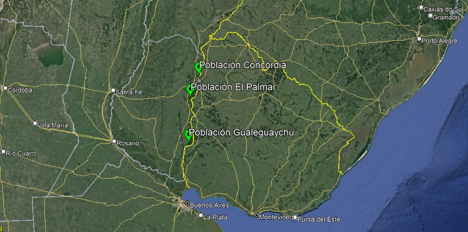

--Sitio en construcción--

# El problema

En respuesta al crecimiento poblacional, surge una mayor demanda de una mayor diversidad de especies vegetales. Además, el aumento en la variabilidad ambiental como resultado del cambio climático, junto con la crisis alimentaria observada en los últimos años, implica que los agricultores y mejoradores de plantas necesitarán acceder a un rango aún más amplio de recursos genéticos vegetales en el futuro. La identificación precisa y rápida de cultivares, así como el reconocimiento de grupos con genotipos similares para determinar la distinción y singularidad de la expresión fenotípica y genética, son clave para mejorar el rendimiento de los cultivares en programas prácticos de mejora.

Argentina es un país con una biodiversidad significativa, donde su gran variedad de climas ofrece una flora altamente diversificada, con alrededor de 10,000 especies vegetales, una cifra que se encuentra en línea con prácticamente toda la flora europea. Sin embargo, es prácticamente desconocida, a pesar de ser de gran importancia como patrimonio económico, social y cultural. Por otro lado, varias centenas de especies permanecen sin utilizar en el mundo a pesar de ser altamente resistentes a adversidades climáticas como el estrés biótico y abiótico, o ser importantes donantes de genes para la mejora de cultivos. Además, se considera que las frutas no tradicionales y subutilizadas desempeñan un papel insustituible en la mitigación de los problemas alimentarios mundiales frente al crecimiento sostenible de la población y la malnutrición.

# La especie

"*Hexachlamys edulis* (O. Berg) Kausel & D. Legrand, conocida como "ubajay" (sin. *Eugenia myrcianthes* Nied.), es sin duda una especie destacada, se distribuye espontáneamente en una zona amplia de América del Sur, principalmente en Argentina, Brasil, Uruguay y Paraguay en los márgenes de los ríos Paraná, Uruguay y otros cursos de agua. Este árbol ofrece frutos nutracéuticos, hojas con metabolitos secundarios de interés, y otros órganos utilizables que brindan grandes beneficios para la salud humana y otros usos etnobotánicos. Es una especie prominente como nueva alternativa para los sistemas de producción."

# **Objetivo general**:

Profundizar en el conocimiento, conservación y valorización de la especie silvestre Hexachlamys edulis mediante una investigación integral de la biodiversidad asociada, la biología reproductiva, el comportamiento postcosecha y su variabilidad. Esto incluye la identificación y descripción de sus hábitats naturales, el análisis de su ciclo fenológico y régimen de polinización, así como la evaluación de su calidad, perfil químico y comportamiento durante la conservación. El propósito final es generar la información necesaria para su inclusión en el Código Alimentario Nacional, facilitando así su mejoramiento, domesticación y desarrollo como cultivo y producto forestal no maderable.

# Metodología general

Se registrarán diversas variables reproductivas, fenológicas, morfológicas y químicas en tres poblaciones de la provincia de Entre Ríos, Argentina: Concordia, el Parque Nacional "El Palmar" y la reserva "El Potrero de San Lorenzo" en Gualeguaychú. Algunos estudios fueron realizados en el Campo Experimental de la Universidad de Morón.

```{r pressure, echo=FALSE, fig.cap="Poblaciones", out.width = '100%'}

```

Los estudios se llevaron a cabo en septiembre (floración) y noviembre (fructificación) de 2019, 2021 y 2022.

Se seleccionaron y caracterizaron genotipos adultos de *H. edulis* (18 por población). En cada temporada se registrarán variables ambientales: precipitación, temperatura, temperatura del suelo, humedad y parámetros edáficos.


# Resultados esperados

Estos estudios serán una contribución esencial para la conservación, posterior mejoramiento y uso sostenible de esta especie, un hecho que permitirá la generación de nuevas alternativas productivas para las actividades agrícolas y forestales y no solo en el área de influencia de la especie.

Estos estudios despertarán el interés de los productores que buscan adaptar sus agroecosistemas hacia la producción sostenible sobre la especie para ser considerada una alternativa en planes de diversificación. Son destacadas las ventajas en términos de servicios ecosistémicos y nuevas posibilidades de comercialización.

A su vez, se espera que la metodología utilizada sea una contribución para futuros estudios sobre la especie y en la familia *Myrtaceae*.

Los resultados serán un estímulo fundamental para que la especie sea incluida en el Código Alimentario Nacional (en un principio en Argentina).

Se buscará la continua publicación en el ámbito académico-científico nacional e internacional, ya sea presentando resutados en eventos científicos tecnológicos o publicciones en revistas científicas de alto impacto, así como parte de futuras tesis de grado y posgrado.
[Ver apartado](https://ipovilonis.github.io/publications.html)

En el proceso de investigación, se fomentará la formación de vocaciones científicas con una visión en la conservación y uso de recursos vegetales nativos.

# Equipo de Trabajo

El laboratorio de Fisiología Vegetal de la Universidad de Morón - CONICET es liderado por las investigadoras Dra. Silvia Radice y la Dra. Miriam Arena.
Parte de los trabajos en H. edulis componen la Tesis Doctoral del Ing. Agr. Ignacio Povilonis.
